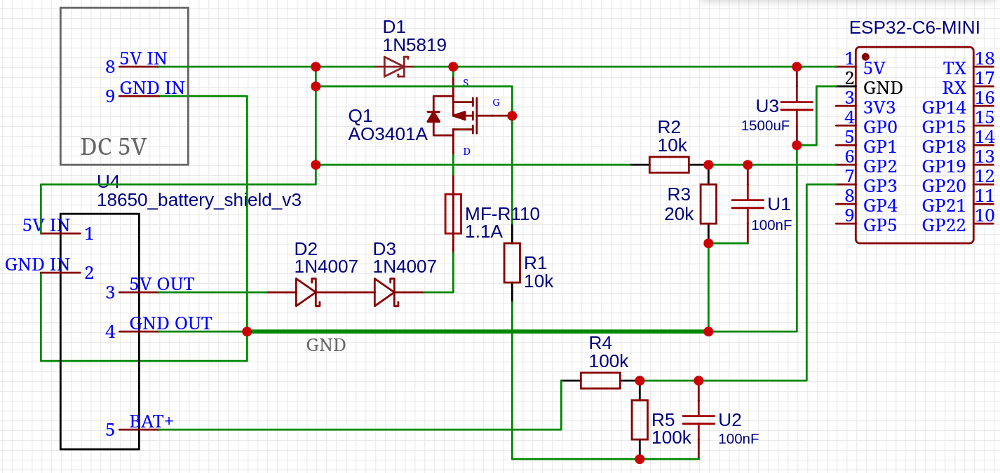

# Hardware V2.3 — UPS Edition (Battery Backup)

## Overview

The UPS Edition keeps the ESP32 online during power outages so it can report POWER_OFF instantly (instead of going silent until power returns). It builds on the V2.1 sensing circuit — same ADC thresholds, same firmware — and adds a battery backup path via a TP4056 charge/discharge shield with an 18650 Li-Ion cell.

Use this variant when you need immediate outage detection rather than inferring outages from device silence.

**Firmware compatibility:** V3.4.0 works without modifications. The firmware doesn't need to know about the battery — it only reads the voltage divider on GPIO2, which is isolated from the power supply path.

## Wiring Diagram

**Power paths:**

- **Mains present:** Adapter 5V -> Diode 1 -> ESP32 5V (~4.3V after diode drop)
- **Mains lost:** Battery -> TP4056 Shield 5V OUT -> Diode 2 -> ESP32 5V (~3.5V after diode drop)

**Sensing path (isolated):**

- Adapter 5V -> R1 (10k) -> GPIO 2 -> R2 (10k) + C1 (0.1uF) -> GND

## Circuit Description

### Dual-Diode OR-Gate

- **Diode 1 (1N4007):** Adapter 5V -> ESP32 5V (mains power path)
- **Diode 2 (1N4007):** TP4056 Shield 5V OUT -> ESP32 5V (battery path)
- Whichever source has higher voltage wins (minus ~0.7V diode drop)
- When mains is present: adapter ~5V - 0.7V = 4.3V > battery ~4.2V - 0.7V = 3.5V -> mains powers ESP32
- When mains is lost: adapter drops to 0V, battery ~4.2V - 0.7V = 3.5V -> battery powers ESP32

### Isolated Sensor Logic (Critical Design Rule)

R1 of the voltage divider connects **BEFORE** Diode 1 — directly to the adapter's 5V output. This is the key design principle:

- When 220V mains is lost: adapter drops to 0V -> GPIO2 reads 0V instantly
- ESP32 stays powered via Diode 2 (battery path) — it can send the POWER_OFF event
- The sensor reads adapter voltage directly, isolated from the battery power supply
- This isolation is what makes the UPS edition work: sensing is decoupled from power supply

> **Never move R1 connection point to after Diode 1** — the sensor must read adapter voltage directly, not the OR-gate output (which would always show battery voltage during outages).

## Firmware Compatibility

- Firmware V3.4.0 works without modifications
- Same ADC thresholds, same voltage divider values (10k/10k + 0.1uF cap)
- The only difference is the power supply path — firmware doesn't need to know about it

## Bill of Materials

| Component | Value/Part                     | Qty | Notes                           |
| --------- | ------------------------------ | --- | ------------------------------- |
| R1        | 10k resistor                   | 1   | Power sense divider input side  |
| R2        | 10k resistor                   | 1   | Power sense divider ground side |
| C1        | 0.1uF ceramic (104)            | 1   | EMI filter, parallel with R2    |
| D1, D2    | 1N4007 diode                   | 2   | OR-gate (any 1N400x works)      |
| R3        | 100k resistor                  | 1   | Battery sense divider input     |
| R4        | 100k resistor                  | 1   | Battery sense divider ground    |
| Shield    | TP4056 charge/discharge module | 1   | Must have 5V OUT pins           |
| Battery   | 18650 Li-Ion cell              | 1   | Protected cell recommended      |

## Battery Monitoring (GPIO3)

The UPS Edition supports real-time battery voltage monitoring via a dedicated ADC channel.

### Wiring

- **100k/100k voltage divider** on GPIO3 reads battery voltage
- Divider halves the battery voltage to stay within the ESP32 ADC range (0–3.3V)
- Li-Ion 18650 range: 3.0V (empty) – 4.2V (full) → ADC sees 1.5V – 2.1V

### Firmware

- Enable with `#define HAS_UPS_MODULE true` in `config.h`
- GPIO3 ADC reading is included in status reports as `batteryVoltage` (millivolts)
- Battery voltage is sent alongside power status in each API request

### Backend & Notifications

- `batteryVoltage` stored on both `Device` (latest reading) and `PowerEvent` (per-event snapshot)
- **SOS Alert**: When voltage drops below **3400 mV** (~33%), a `battery.low` event triggers a `🆘 Low Battery Alert` Telegram notification with a **15-minute cooldown** between alerts
- **Power Lost** notifications include battery level when available
- `/status` command shows `🔋 Battery: X.XXV (YY%)` for UPS devices
- Battery percentage uses linear mapping: 3000 mV = 0%, 4200 mV = 100%

## Future Optimizations (TODO)

### Hardware V2.4 — Priority UPS

- Replace Diode 1 with Schottky (SS34) for lower voltage drop (~0.3V vs 0.7V)
- Or implement P-MOSFET load-sharing circuit for near-zero drop
- Goal: ensure 100% mains bypass of battery when mains is present (production-grade)
